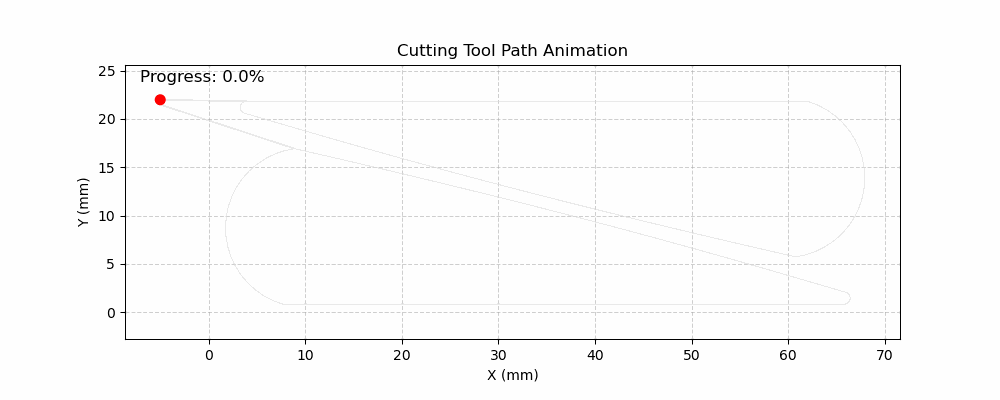
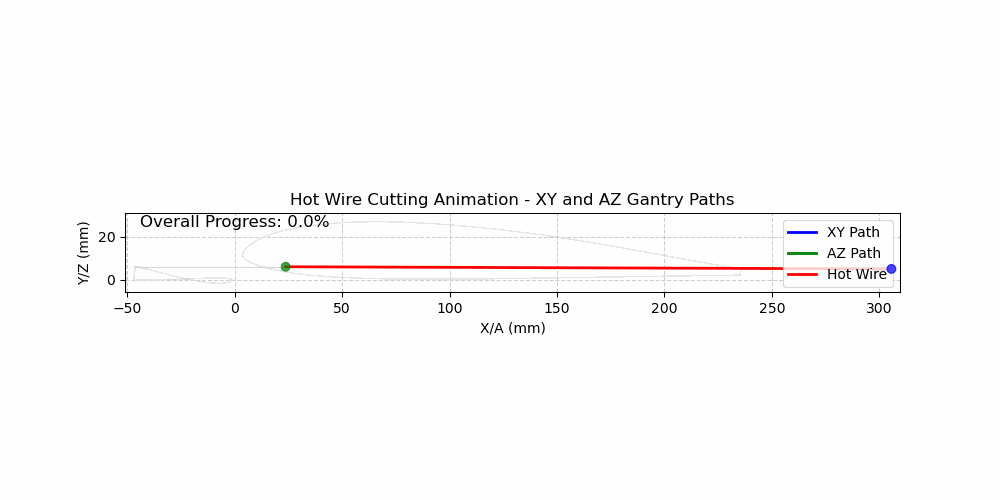
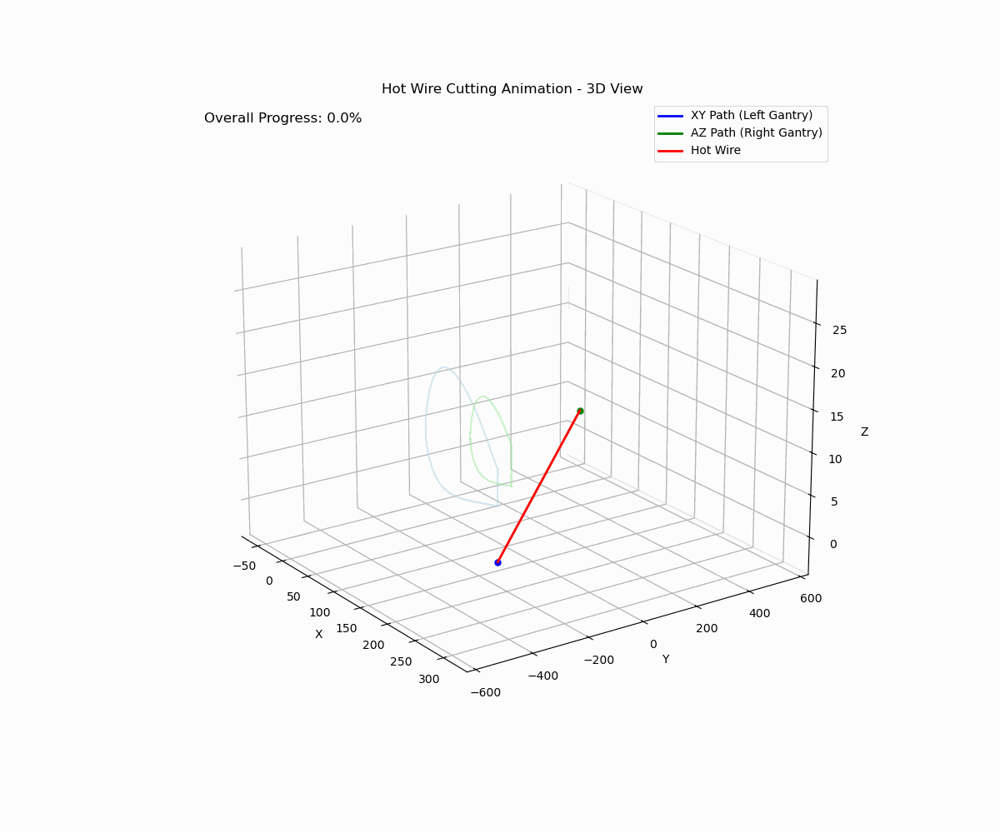
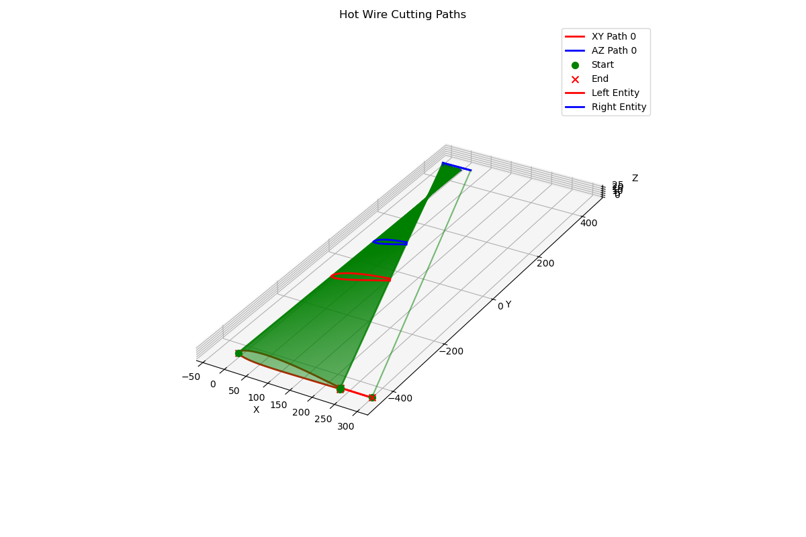

# HotWire CNC G-code Generator

This repository contains a Python-based toolset for generating G-code for 4-axis hot wire CNC machines. It provides functionality to import DXF and STEP files, visualize entities, optimize cutting paths, and generate G-code for hotwire foam cutting for both 2D profiles and 3D shapes.

## Features

### General Features
- **Entity Visualization**: Interactive plotting of entities with color coding and ID labels
- **Toolpath Animation**: Animated visualization of the cutting process before G-code generation
- **G-code Generation**: Output standard G-code compatible with most hot wire CNC controllers

### 2D Profile Cutting (hotwire_gcode.ipynb)
- **DXF File Import**: Load and parse standard DXF files to extract entities (lines, arcs, circles, polylines, splines)
- **Manual Path Ordering**: Define custom cutting order for complex profiles
- **Path Optimization**: Automatically optimize cutting paths to minimize movement

### 3D Shape Cutting (hotwire_gcode_3d.ipynb)
- **STEP File Import**: Load 3D models from STEP files and extract cutting profiles
- **Face Selection**: Visually select faces for creating cutting paths
- **Synchronized Dual-Gantry Paths**: Generate coordinated movement for both sides of the hot wire
- **Entry/Exit Path System**: Configure horizontal lead-in and lead-out paths to ensure clean foam cutting

## Visualizations

### 2D Profile Cutting


### 3D Dual-Gantry Cutting (2D View)


### 3D Dual-Gantry Cutting (3D View)


### 3D Cutting Paths Visualization


## Requirements

- Python 3.6+
- Required packages:
  - ezdxf (for DXF handling)
  - numpy
  - matplotlib
  - scipy (for advanced spline handling)
  - IPython (for notebook interface)
  - cadquery (for 3D model import, required for 3D functionality)

## Installation

```
# Clone the repository
git clone https://github.com/yourusername/hotwire-gcode-generator.git
cd hotwire-gcode-generator
```

# Install dependencies for 2D functionality
```
pip install ezdxf numpy matplotlib scipy ipython
```

# For 3D functionality, also install:
```
pip install cadquery
```

## Usage

### 2D Profile Cutting Workflow

Use the `hotwire_gcode.ipynb` notebook for cutting 2D profiles where both sides of the wire follow the same path.

#### Input Files
- DXF files containing lines, arcs, circles, polylines, or splines

#### Basic Workflow

1. **Import DXF file**
   ```
   entities = read_cad_file("your_design.dxf")
   ```

2. **Visualize the entities**
   ```
   plot_entities(entities)
   ```

3. **Define cutting order manually** (using entity indices displayed in the visualization)
   ```
   order = [13, 9, 10, 7, 8, 1, 2, 3, 4, 12]  # Entity indices
   points = manual_order_path(entities, order)
   ```

4. **Scale and adjust as needed**
   ```
   points = np.array(points)
   points = points * 25.4  # Convert from inches to mm
   points[:, 0] -= points[:, 0].min()  # Shift to start at x=0
   ```

5. **Visualize the cutting path**
   ```
   plt.scatter(*zip(*points), c=np.linspace(0, 1, len(points)), cmap="viridis", s=0.5)
   plt.colorbar(label="Path order")
   plt.gca().set_aspect("equal", adjustable="box")
   plt.show()
   ```

6. **Animate the toolpath**
   ```
   ani = animate_tool_path(points, tool_speed=0.5, tool_size=0.025, fps=30)
   from IPython.display import HTML
   HTML(ani.to_jshtml())
   ```

7. **Generate G-code**
   ```
   gcode = generate_gcode(points, feed_rate=200.0, wire_current=1000)
   write_gcode_file(gcode, "output.ngc")
   ```

### 3D Shape Cutting Workflow

Use the `hotwire_gcode_3d.ipynb` notebook for cutting 3D shapes where each end of the wire follows different paths.

#### Input Files
- STEP files containing 3D geometry (wings, airfoils, etc.)

#### Basic Workflow

1. **Import STEP file**
   ```
   faces, face_centers = load_step_file("your_model.step")
   ```

2. **Visualize faces with ID numbers**
   ```
   visualize_faces(faces, face_centers)
   ```

3. **Select faces for cutting** (using face IDs from visualization)
   ```
   selected_faces = [7, 8, 12, 13]  # Face indices
   ```

4. **Extract entities from the selected faces**
   ```
   left_entities = extract_face_edges(faces[selected_faces[0]])
   right_entities = extract_face_edges(faces[selected_faces[1]])
   ```

5. **Visualize the extracted entities**
   ```
   visualize_entities_3d([left_entities, right_entities])
   ```

6. **Configure left and right cutting paths** with entry and exit paths
   ```
   # Configure entry/exit points
   entry_exit_config = {
       101: {
           "type": "entry",
           "distance": [50, 0],  # [X, Z] distance in mm
       },
       102: {
           "type": "exit",
           "distance": [50, 0],  # [X, Z] distance in mm
       }
   }
   
   # Define the cutting path using entity indices
   left_plane_entities = [101, 11, 10, 9, 102]  # Start with entry, end with exit
   right_plane_entities = [101, 6, 7, 8, 102]   # Same virtual IDs on both sides
   ```

7. **Generate cutting paths**
   ```
   cutting_paths = generate_cutting_paths_from_entities(
       left_plane_entities, 
       right_plane_entities, 
       entities,
       entry_exit_config=entry_exit_config
   )
   ```

8. **Visualize the cutting paths**
   ```
   visualize_cutting_paths(cutting_paths, left_entities, right_entities, gantry_gap=GANTRY_GAP)
   ```

9. **Create animation**
   ```
   animation = create_dual_gantry_animation(cutting_paths, save_gif=True)
   display(animation)
   ```

10. **Generate G-code**
   ```
   gcode = generate_dual_gantry_gcode(cutting_paths, feed_rate=200.0, wire_current=1000)
   write_gcode_file(gcode, "output_3d.ngc")
   ```

## Entry and Exit Path System

The 3D cutting module includes a configurable entry and exit path system that ensures the hot wire enters and exits the foam horizontally at the same rate on both sides. This is essential for clean cuts without snagging or deforming the foam.

### How It Works

1. **Virtual Entity IDs**: Special entity IDs (typically 100+) represent entry and exit paths in the cutting sequence
2. **Horizontal Approach**: The wire approaches the foam with synchronized movement on both gantries
3. **Same-rate Movement**: Both sides of the wire enter and exit at the same rate, ensuring clean cuts
4. **Configurable Distance**: Set how far from the actual cutting profile the entry and exit moves should begin/end

### Configuration Parameters

The `entry_exit_config` dictionary allows you to configure:

- `"type"`: Either "entry" or "exit" to specify the purpose
- `"distance"`: A list [X, Z] specifying horizontal approach/exit distances (mm)
- `"feed_rate"`: Optional custom feed rate for the entry/exit move
- `"direction"`: Optional control over approach/exit angle

### Example Configuration

```
entry_exit_config = {
    101: {
        "type": "entry",         # Marks this as an entry path
        "distance": [50, 0],     # Horizontal approach: 50mm in X, 0mm in Z
        "feed_rate": 150.0,      # Optional: slower feed rate for entry
    },
    102: {
        "type": "exit",          # Marks this as an exit path
        "distance": [-30, 0],    # Exit direction: -30mm in X, 0mm in Z
    }
}

# Include these virtual entities in your cutting path
left_plane_entities = [101, 5, 6, 7, 102]  # Entry → Profile → Exit
right_plane_entities = [101, 8, 9, 10, 102]
```

## Key Functions

### 2D Functionality
- `read_cad_file(file_path)`: Import DXF files and extract entities
- `entity_to_points(entity, scale=1.0)`: Convert DXF entities to point lists
- `plot_entities(entities)`: Visualize all entities with type identification
- `manual_order_path(entities, order)`: Create a cutting path with custom entity order
- `animate_tool_path(points)`: Generate an interactive animation of the cutting process
- `generate_gcode(points, feed_rate, wire_current)`: Create G-code for the cutting path

### 3D Functionality
- `load_step_file(filename)`: Load a STEP file and extract faces
- `visualize_faces(faces, face_centers)`: Display faces with ID numbers
- `extract_face_edges(face)`: Extract edges from a face with adaptive sampling
- `visualize_entities_3d(entities)`: Create a 3D visualization of extracted entities
- `generate_cutting_paths_from_entities()`: Create synchronized paths for dual-gantry cutting
- `create_dual_gantry_animation()`: Animate the dual-gantry cutting process
- `generate_dual_gantry_gcode()`: Generate G-code for 3D cutting with entry/exit paths

## G-code Output

The generated G-code includes:

- Standard setup commands (G17, G21, G90, etc.)
- Wire heating control (M3/M5)
- 4-axis synchronized movement (X,Y for one end, A,Z for the other)
- Feed rate and dwell time control
- Smooth entry and exit movements for clean foam cutting

Example:
```
G0 X0.000 Y10.000 A0.000 Z10.000; Rapid move to start position
G1 X20.000 Y15.000 A20.000 Z15.000
G1 X40.000 Y12.000 A40.000 Z12.000
```

## Performance Notes

For large files or complex animations, you may experience performance issues. Some tips:

- Reduce the number of points in arcs and splines by adjusting `points_per_arc`
- Lower the `fps` parameter in animations for smoother playback
- Use the optimized animation functions for large point sets
- For 3D models, simplify complex faces by reducing the tessellation parameters

## Contact

Developed by Koji  
Email: dbf@koji.space

## Warning

This was my vibe coding project. This software is provided as-is with no guarantees. Always verify the generated G-code before running it on your CNC machine.

## Contributing

Contributions are welcome! Please feel free to submit a Pull Request.